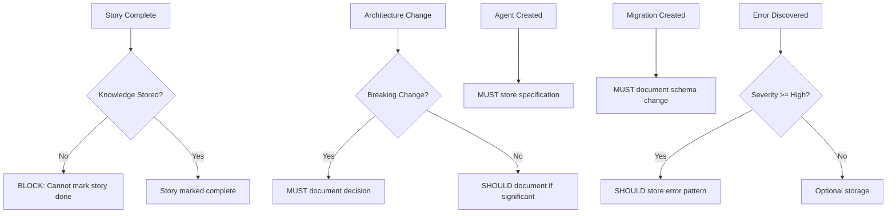

# BMad Integration Rules for Qdrant MCP

**Enforcement Rules for BMad Agents Using Qdrant MCP Knowledge Management**

---

## 🎯 Purpose

This document defines **strict, enforceable rules** that all BMad agents MUST follow when using Qdrant MCP for knowledge storage. These rules ensure:
- **Consistency**: All knowledge follows the same structure
- **Quality**: Only valuable information is stored
- **No Duplicates**: Content hashing and similarity checks prevent redundancy
- **Traceability**: Every storage action is logged and tracked

---

## ⚠️ CRITICAL: Rule Enforcement

**ALL BMad agents MUST**:
1. Follow these rules **without exception**
2. Validate before storing (pre-storage checks)
3. Log all storage actions
4. Ask user if uncertain about storage decision

**VIOLATIONS**:
- Storage without validation → REJECTED
- Missing required metadata → REJECTED
- Duplicate content → SKIPPED with warning
- Low-quality content → REJECTED with explanation

---

## 📋 RULE 1: MANDATORY Storage Triggers

### When Storage is REQUIRED

| Trigger Event | What to Store | Required Metadata |
|---------------|---------------|-------------------|
| **Story Completion** | Implementation outcome, integration points, common errors, testing patterns | unique_id, story_id, epic_id, type="story_outcome" |
| **Architecture Change** | Decision justification, trade-offs, alternatives, impacts | unique_id, breaking_change=True, type="architecture_decision" |
| **Agent Creation/Update** | Specification, dependencies, integration points, common errors | unique_id, agent_id, type="agent_spec" |
| **Database Migration** | Schema changes, constraints, migration number | unique_id, migration_number, type="database_schema" |
| **Critical Error Discovery** | Error pattern, root cause, solution, prevention | unique_id, severity="critical" or "high", type="error_pattern" |

### Enforcement

```python
# MANDATORY: After story completion
if story_status == "completed":
    if not knowledge_stored:
        raise ValidationError("Story marked complete without knowledge storage")
```

---

## 📋 RULE 2: ALLOWED Storage Types

### Permitted Content Types

Only the following types are allowed:

1. **architecture_decision**
   - Breaking changes to system design
   - Major technology choices
   - Architectural patterns established

2. **agent_spec**
   - New agent specifications
   - Major agent updates (breaking changes)
   - Agent integration patterns

3. **story_outcome**
   - Completed story implementations
   - Integration points documented
   - Common errors discovered

4. **error_pattern**
   - Severity: critical or high only
   - Root cause identified
   - Solution validated

5. **database_schema**
   - Migration-based changes only
   - Constraint modifications
   - Critical table structures

6. **config_pattern**
   - Environment setup patterns
   - Configuration best practices

7. **integration_example**
   - Working code examples
   - Tested integration patterns

### Type Validation

```python
ALLOWED_TYPES = [
    "architecture_decision",
    "agent_spec",
    "story_outcome",
    "error_pattern",
    "database_schema",
    "config_pattern",
    "integration_example"
]

if metadata["type"] not in ALLOWED_TYPES:
    raise ValidationError(f"Invalid type: {metadata['type']}")
```

---

## 📋 RULE 3: FORBIDDEN Storage

### NEVER Store

| Category | Examples | Where to Store Instead |
|----------|----------|------------------------|
| **Credentials** | Passwords, API keys, tokens | .env files, secrets manager |
| **Operational Data** | Processing status, job queues, metrics | PostgreSQL tables |
| **Binary Files** | PDFs, images, documents | Filesystem, object storage |
| **Transactional Data** | User sessions, temporary state | Redis, PostgreSQL |
| **Trivial Details** | Debug logs, temporary notes, TODO comments | Code comments, task tracker |
| **Frequently Changing** | Feature flags, dynamic config | Config files, environment variables |

### Enforcement

```python
FORBIDDEN_PATTERNS = [
    r"password",
    r"api_key",
    r"secret",
    r"token",
    r"TODO:",
    r"DEBUG:",
    r"FIXME:"
]

for pattern in FORBIDDEN_PATTERNS:
    if re.search(pattern, information, re.IGNORECASE):
        raise ValidationError(f"Forbidden pattern detected: {pattern}")
```

---

## 📋 RULE 4: Deduplication Requirements

### MANDATORY Deduplication Checks

**Before EVERY storage operation**:

```python
# Step 1: Generate content hash
content_hash = hashlib.sha256(information.encode()).hexdigest()
metadata["content_hash"] = content_hash

# Step 2: Check for exact duplicate
existing = mcp__qdrant__qdrant-find(
    query=f"content_hash:{content_hash}"
)

if existing:
    log_duplicate_skip(content_hash)
    return "DUPLICATE_SKIPPED"

# Step 3: Semantic similarity check
similar = mcp__qdrant__qdrant-find(
    query=information[:200]  # First 200 chars
)

if similar and get_similarity_score(similar[0]) > 0.85:
    ask_user_confirmation("Similar content exists. Store anyway?")
    if not user_confirms:
        return "SIMILAR_SKIPPED"

# Step 4: Check unique_id collision
if "unique_id" in metadata:
    existing_id = mcp__qdrant__qdrant-find(
        query=f"unique_id:{metadata['unique_id']}"
    )

    if existing_id:
        # Update workflow, not create
        return handle_update(metadata["unique_id"], information, metadata)
```

### unique_id Format Rules

| Type | Format | Example |
|------|--------|---------|
| Architecture Decision | `arch-decision-{topic}-{YYYYMMDD}` | `arch-decision-5tier-qdrant-20241215` |
| Agent Spec | `agent-{id}-spec` | `agent-15-spec` |
| Story Outcome | `story-{epic}-{story}-complete` | `story-2-17-complete` |
| Error Pattern | `error-{short-desc}-{YYYYMMDD}` | `error-docker-connection-20251228` |
| Database Schema | `schema-{table}-{migration}` | `schema-chunks-migration-024` |

---

## 📋 RULE 5: Metadata Validation Rules

### Required Fields

**ALL entries MUST include**:

```python
REQUIRED_FIELDS = [
    "unique_id",      # str: Unique identifier
    "type",           # str: One of ALLOWED_TYPES
    "component",      # str: System component affected
    "importance",     # str: critical, high, medium, low
    "created_at"      # str: ISO 8601 timestamp
]
```

### Optional But Recommended

```python
RECOMMENDED_FIELDS = [
    "story_id",       # str: Story identifier (e.g., "2-17")
    "epic_id",        # str: Epic number
    "affects",        # list[str]: Impacted systems
    "keywords",       # list[str]: Search terms
    "related_ids",    # list[str]: Cross-references
    "search_intent"   # list[str]: How this might be searched
]
```

### Field Constraints

```python
FIELD_CONSTRAINTS = {
    "importance": {
        "type": "enum",
        "values": ["critical", "high", "medium", "low"]
    },
    "type": {
        "type": "enum",
        "values": ALLOWED_TYPES
    },
    "confidence": {
        "type": "float",
        "min": 0.0,
        "max": 1.0
    },
    "version": {
        "type": "integer",
        "min": 1
    },
    "breaking_change": {
        "type": "boolean"
    },
    "deprecated": {
        "type": "boolean"
    }
}
```

### Validation Function

```python
def validate_metadata(metadata):
    """Validate metadata against schema"""
    # Check required fields
    for field in REQUIRED_FIELDS:
        if field not in metadata:
            raise ValidationError(f"Missing required field: {field}")

    # Check field constraints
    if metadata["importance"] not in ["critical", "high", "medium", "low"]:
        raise ValidationError(f"Invalid importance: {metadata['importance']}")

    if metadata["type"] not in ALLOWED_TYPES:
        raise ValidationError(f"Invalid type: {metadata['type']}")

    if "confidence" in metadata:
        if not (0.0 <= metadata["confidence"] <= 1.0):
            raise ValidationError(f"Confidence must be 0.0-1.0: {metadata['confidence']}")

    return True
```

---

## 📋 RULE 6: Workflow Enforcement

### Mandatory Workflows



### Enforcement Rules

| Event | Rule | Enforcement Level |
|-------|------|-------------------|
| Story completion | MUST store outcome | MANDATORY - Blocks story done |
| Architecture change (breaking) | MUST document | MANDATORY |
| Agent creation | MUST store spec | MANDATORY |
| Migration creation | MUST document schema | MANDATORY |
| Error discovery (high/critical) | SHOULD store pattern | RECOMMENDED |
| Architecture change (non-breaking) | SHOULD document | RECOMMENDED |
| Performance improvement | MAY store | OPTIONAL |

---

## 📋 RULE 7: Quality Standards

### Content Quality Requirements

```python
QUALITY_STANDARDS = {
    "min_length": 100,      # Minimum characters
    "max_length": 5000,     # Maximum (chunk if longer)
    "required_sections": {
        "story_outcome": ["what", "integration", "errors", "testing"],
        "agent_spec": ["purpose", "input", "output", "dependencies"],
        "error_pattern": ["error", "cause", "solution", "prevention"],
        "architecture_decision": ["decision", "justification", "tradeoffs"]
    }
}
```

### Validation

```python
def validate_quality(information, metadata):
    """Validate content quality"""
    # Length check
    if len(information) < QUALITY_STANDARDS["min_length"]:
        raise ValidationError(f"Content too short ({len(information)} < 100 chars)")

    if len(information) > QUALITY_STANDARDS["max_length"]:
        warn("Content exceeds 5000 chars - consider chunking")

    # Required sections for type
    content_type = metadata["type"]
    if content_type in QUALITY_STANDARDS["required_sections"]:
        required = QUALITY_STANDARDS["required_sections"][content_type]
        for section in required:
            if section.lower() not in information.lower():
                warn(f"Missing recommended section: {section}")

    return True
```

---

## 📋 RULE 8: Search Before Store Protocol

### MANDATORY Pre-Storage Workflow

```python
def store_knowledge_with_validation(information, metadata):
    """
    Complete storage workflow with all validations
    """
    # Step 1: Generate content hash
    content_hash = hashlib.sha256(information.encode()).hexdigest()
    metadata["content_hash"] = content_hash

    # Step 2: Check exact duplicate (hash match)
    existing_hash = search_by_hash(content_hash)
    if existing_hash:
        log_action("DUPLICATE_SKIPPED", content_hash)
        return {
            "status": "duplicate_skipped",
            "reason": "Exact content hash match found"
        }

    # Step 3: Check semantic similarity
    first_100_chars = information[:100]
    similar = mcp__qdrant__qdrant-find(query=first_100_chars)

    if similar:
        similarity_score = calculate_similarity(similar[0], information)
        if similarity_score > 0.85:
            user_decision = ask_user_question(
                f"Similar content exists (score: {similarity_score:.2f}). Store anyway?"
            )
            if not user_decision:
                log_action("SIMILAR_SKIPPED", metadata["unique_id"])
                return {
                    "status": "similar_skipped",
                    "reason": f"User declined (similarity: {similarity_score})"
                }

    # Step 4: Validate metadata schema
    validate_metadata(metadata)

    # Step 5: Validate quality standards
    validate_quality(information, metadata)

    # Step 6: Store
    mcp__qdrant__qdrant-store(
        information=information,
        metadata=metadata
    )

    # Step 7: Log to inventory
    update_knowledge_inventory(metadata["unique_id"], metadata)

    log_action("STORED", metadata["unique_id"])
    return {
        "status": "stored",
        "unique_id": metadata["unique_id"]
    }
```

---

## 📋 RULE 9: Update Protocol

### For Breaking Changes

```python
def update_with_versioning(unique_id, new_information, new_metadata):
    """
    Update with version tracking for breaking changes
    """
    # Find existing
    existing = find_by_unique_id(unique_id)

    if existing:
        version = existing["metadata"].get("version", 1)

        # Mark old as deprecated
        deprecate_entry(
            unique_id=unique_id,
            superseded_by=f"{unique_id}-v{version+1}"
        )

        # Create new version
        new_metadata.update({
            "unique_id": f"{unique_id}-v{version+1}",
            "version": version + 1,
            "replaces": unique_id,
            "created_at": now()
        })

        store_knowledge_with_validation(new_information, new_metadata)

        return f"version_{version+1}_created"

    # First version
    new_metadata.update({
        "unique_id": unique_id,
        "version": 1
    })

    store_knowledge_with_validation(new_information, new_metadata)
    return "created"
```

### For Minor Updates

```python
def update_in_place(unique_id, updated_information):
    """
    Update existing entry for minor changes
    """
    existing = find_by_unique_id(unique_id)

    if not existing:
        raise NotFoundError(f"No entry found: {unique_id}")

    # Preserve metadata, update specific fields
    metadata = existing["metadata"].copy()
    metadata["last_updated"] = now()
    metadata["update_count"] = metadata.get("update_count", 0) + 1

    # Re-store (Qdrant MCP doesn't have update API)
    store_knowledge_with_validation(updated_information, metadata)

    return "updated"
```

---

## 📋 RULE 10: Validation Gates

### Pre-Storage Gates

```python
def pre_storage_validation(information, metadata):
    """
    All validation gates before storage
    """
    gates = [
        ("Metadata Schema", validate_metadata),
        ("Content Quality", validate_quality),
        ("Duplicate Check", check_duplicates),
        ("Type Validation", validate_type),
        ("Forbidden Content", check_forbidden_patterns)
    ]

    for gate_name, gate_func in gates:
        try:
            gate_func(information, metadata)
            log_gate_pass(gate_name)
        except ValidationError as e:
            log_gate_fail(gate_name, str(e))
            raise ValidationError(f"Failed at {gate_name}: {e}")

    return True
```

### Post-Storage Actions

```python
def post_storage_actions(unique_id, metadata):
    """
    Actions after successful storage
    """
    # Update inventory
    update_knowledge_inventory(unique_id, metadata)

    # Log storage action
    log_storage_action(
        unique_id=unique_id,
        type=metadata["type"],
        importance=metadata["importance"],
        timestamp=now()
    )

    # Trigger any webhooks/notifications
    if metadata["importance"] == "critical":
        notify_critical_knowledge_added(unique_id)
```

### Weekly Review

```python
def weekly_review():
    """
    Weekly maintenance tasks
    """
    # Find deprecated entries
    deprecated = find_deprecated_entries()

    # Check for broken references
    check_cross_references()

    # Identify duplicates that slipped through
    find_potential_duplicates(threshold=0.90)

    # Generate review report
    generate_review_report()
```

---

## 🛠️ Implementation Files

### 1. validation/validate_metadata.py

```python
"""
Metadata validation against JSON schemas
"""
import json
from jsonschema import validate, ValidationError

def validate_metadata_schema(metadata, schema_type):
    """
    Validate metadata against JSON schema for type

    Args:
        metadata: dict - Metadata to validate
        schema_type: str - Type of schema (agent_spec, story_outcome, etc.)

    Returns:
        bool - True if valid

    Raises:
        ValidationError - If validation fails
    """
    schema_path = f"metadata-schemas/{schema_type}.json"

    with open(schema_path) as f:
        schema = json.load(f)

    try:
        validate(instance=metadata, schema=schema)
        return True
    except ValidationError as e:
        raise ValidationError(f"Schema validation failed: {e.message}")
```

### 2. validation/check_duplicates.py

```python
"""
Duplicate detection and similarity checking
"""
import hashlib

def generate_content_hash(content):
    """Generate SHA256 hash of content"""
    return hashlib.sha256(content.encode()).hexdigest()

def check_for_duplicates(information, metadata):
    """
    Check for exact and semantic duplicates

    Returns:
        dict: {
            "is_duplicate": bool,
            "duplicate_type": "exact" | "similar" | None,
            "similarity_score": float,
            "existing_id": str | None
        }
    """
    content_hash = generate_content_hash(information)

    # Check exact match
    exact_match = search_by_hash(content_hash)
    if exact_match:
        return {
            "is_duplicate": True,
            "duplicate_type": "exact",
            "similarity_score": 1.0,
            "existing_id": exact_match["unique_id"]
        }

    # Check semantic similarity
    similar = mcp__qdrant__qdrant-find(query=information[:200])
    if similar:
        score = calculate_similarity(similar[0], information)
        if score > 0.85:
            return {
                "is_duplicate": True,
                "duplicate_type": "similar",
                "similarity_score": score,
                "existing_id": similar[0]["unique_id"]
            }

    return {
        "is_duplicate": False,
        "duplicate_type": None,
        "similarity_score": 0.0,
        "existing_id": None
    }
```

### 3. tracking/knowledge_inventory.md

```markdown
# Qdrant MCP Knowledge Inventory

**Last Updated**: 2025-12-28

## Summary

- **Total Entries**: 0
- **By Type**:
  - Architecture Decisions: 0
  - Agent Specifications: 0
  - Story Outcomes: 0
  - Error Patterns: 0
  - Database Schemas: 0

## Entries

### Architecture Decisions

| unique_id | Title | Importance | Created | Deprecated |
|-----------|-------|------------|---------|------------|
| - | - | - | - | - |

### Agent Specifications

| unique_id | Agent | Importance | Created | Deprecated |
|-----------|-------|------------|---------|------------|
| - | - | - | - | - |

### Story Outcomes

| unique_id | Story | Importance | Created | Deprecated |
|-----------|-------|------------|---------|------------|
| - | - | - | - | - |

### Error Patterns

| unique_id | Component | Severity | Created | Deprecated |
|-----------|-----------|----------|---------|------------|
| - | - | - | - | - |

### Database Schemas

| unique_id | Table | Migration | Created | Deprecated |
|-----------|-------|-----------|---------|------------|
| - | - | - | - | - |
```

### 4. tracking/review_log.md

```markdown
# Knowledge Base Review Log

## 2025-12-28 - Initial Setup

- [ ] Created knowledge management structure
- [ ] Defined BMad integration rules
- [ ] Set up validation scripts
- [ ] Initialized tracking files

## Monthly Review Template

### [YYYY-MM] - Review

**Date**: YYYY-MM-DD
**Reviewer**: [Name]

#### Actions Taken

- [ ] Reviewed all entries for accuracy
- [ ] Deprecated outdated entries
- [ ] Added cross-references
- [ ] Identified gaps in coverage
- [ ] Consolidated duplicates

#### Statistics

- **Total Entries**: N
- **New This Month**: N
- **Deprecated This Month**: N
- **Updated This Month**: N

#### Gaps Identified

1. [Gap description]
2. [Gap description]

#### Action Items

- [ ] Document [missing knowledge]
- [ ] Update [outdated entry]
- [ ] Consolidate [duplicate entries]
```

---

## ✅ Compliance Checklist

Before storing ANY knowledge, verify:

- [ ] Content passes quality standards (100+ chars, includes required sections)
- [ ] Metadata includes all required fields
- [ ] Content hash generated and checked
- [ ] Semantic similarity checked (threshold 0.85)
- [ ] Type is in ALLOWED_TYPES list
- [ ] No forbidden patterns detected
- [ ] Unique_id follows format rules
- [ ] Field constraints validated
- [ ] User approval obtained (if similar content exists)
- [ ] Knowledge inventory will be updated post-storage

---

## 🚨 Violation Handling

### If Rule is Violated

1. **REJECT storage immediately**
2. **Log violation** with details
3. **Notify user** of failure reason
4. **Provide guidance** on how to fix
5. **Do NOT proceed** without fixing violation

### Example Violation Responses

```python
# Missing required field
raise ValidationError(
    "Cannot store: Missing required field 'unique_id'. "
    "Please add metadata['unique_id'] = 'story-2-17-complete'"
)

# Forbidden content
raise ValidationError(
    "Cannot store: Forbidden pattern 'password' detected. "
    "Credentials must not be stored in knowledge base. "
    "Use .env files instead."
)

# Duplicate content
return {
    "status": "rejected",
    "reason": "Duplicate content detected (hash: a7f3c2e1...)",
    "existing_id": "story-2-17-complete",
    "action": "Use update workflow instead of create"
}
```

---

## RULE 11: Best Practice Storage (Automatic by Agents)

### Overview

**NEW**: Agent-discovered best practices are automatically stored to a separate collection (configured via `QDRANT_BEST_PRACTICES_COLLECTION`, default: `bmad-best-practices`) when agents research best practices during their work.

**Key Principle**: Agents research best practices for technologies they're using. When they find valuable, validated patterns, they automatically store them for future reference.

### When to Store Best Practices

**AUTOMATIC STORAGE** when all conditions met:

```python
def should_store_best_practice(discovery):
    """
    Determine if discovered best practice should be stored
    """
    conditions = [
        discovery["source"] in TRUSTED_SOURCES,  # Official docs, research papers, etc.
        discovery["confidence"] >= 0.85,         # High confidence
        discovery["applicability"] != "deprecated",  # Not outdated
        discovery["relevance"] in ["universal", "project_relevant"],  # Broadly applicable
        len(discovery["information"]) >= 200,    # Sufficient detail
    ]

    return all(conditions)
```

### Trusted Sources

```python
TRUSTED_SOURCES = [
    "official_documentation",   # Vendor docs (Qdrant, PostgreSQL, etc.)
    "research_paper",           # Academic research
    "vendor_recommendation",    # Official vendor guidance
    "benchmark_study",          # Performance benchmarks
    "conference_talk",          # Industry conferences
    "book"                      # Technical books
]

# UNTRUSTED (do not store):
# - Random blog posts (unless from known experts)
# - Stack Overflow answers (verify first)
# - Forum posts
# - Personal opinions without evidence
```

### Required Metadata for Best Practices

**MUST include all fields from best_practice.json schema**:

```python
REQUIRED_BEST_PRACTICE_FIELDS = [
    # Identity
    "unique_id",           # Format: bp-{technology}-{topic}-{YYYY-MM-DD}
    "content_hash",        # SHA256 for deduplication
    "type",                # Must be "best_practice"

    # Classification
    "domain",              # database, infrastructure, ml, nlp, api, etc.
    "technology",          # Specific technology (postgresql, qdrant, etc.)
    "category",            # performance, security, scalability, etc.
    "component",           # System component
    "importance",          # critical, high, medium, low

    # Discovery
    "created_at",          # Discovery date
    "discovered_by",       # Agent ID (e.g., "agent_15")
    "discovery_context",   # What agent was researching
    "story_id",            # Story during which this was discovered
    "epic_id",             # Epic number

    # Source
    "source",              # Type of source
    "source_url",          # URL where found
    "confidence",          # 0.0-1.0 confidence score

    # Search Optimization
    "keywords"             # Array of search terms
]
```

### Automatic Storage Workflow

```python
def agent_discovers_best_practice(agent_id, research_context):
    """
    Called automatically when agent finds best practice during research
    """
    # Step 1: Extract information
    information = extract_best_practice_content()

    # Step 2: Build metadata
    metadata = {
        "unique_id": generate_unique_id("bp", technology, topic, date),
        "type": "best_practice",
        "discovered_by": agent_id,
        "discovery_context": research_context,
        "story_id": get_current_story_id(),
        "epic_id": get_current_epic_id(),
        # ... other fields
    }

    # Step 3: Validate
    is_valid, messages = validate_metadata(metadata, "best_practice")
    if not is_valid:
        log_validation_failure(messages)
        return False

    # Step 4: Check duplicates
    duplicates_found, dup_messages = check_duplicates(
        information, metadata, similarity_threshold=0.85
    )
    if duplicates_found:
        log_duplicate_skipped(dup_messages)
        return False

    # Step 5: Store to best practices collection
    mcp__qdrant__qdrant-store(
        information=information,
        metadata=metadata,
        collection="bmad-best-practices"  # IMPORTANT: Separate collection (configurable)
    )

    # Step 6: Update tracking
    update_best_practices_inventory(metadata["unique_id"], metadata)

    log_best_practice_stored(metadata["unique_id"])
    return True
```

### Collection Routing

**CRITICAL**: Best practices MUST go to the best practices collection (configurable via environment):

```python
from config import KNOWLEDGE_COLLECTION, BEST_PRACTICES_COLLECTION

def route_to_collection(metadata):
    """
    Route storage to correct collection based on type
    """
    if metadata["type"] == "best_practice":
        return BEST_PRACTICES_COLLECTION  # Default: "bmad-best-practices"
    else:
        # All other types
        return KNOWLEDGE_COLLECTION  # Default: "bmad-knowledge"
```

### Quality Standards for Best Practices

**Minimum Requirements**:

```python
BEST_PRACTICE_QUALITY = {
    "min_length": 200,          # Minimum 200 chars
    "max_length": 10000,        # Maximum 10K chars
    "must_include": [
        "CONTEXT",              # Why this matters
        "BEST PRACTICE",        # What to do
        "IMPLEMENTATION",       # How to do it (with code if applicable)
        "TRADE-OFFS",           # Pros and cons
    ],
    "should_include": [
        "PERFORMANCE IMPACT",   # Quantified if possible
        "PREREQUISITES",        # What's needed
        "ANTI-PATTERNS",        # What NOT to do
        "VALIDATION",           # How to verify it works
    ],
    "code_example": {
        "required_if": "implementation involves code",
        "must_be_working": True,
        "must_include_comments": True
    }
}
```

### Example Best Practice Discovery

```python
# Agent 15 discovers Qdrant batch optimization while researching storage routing

def agent_15_research_session():
    """
    Agent 15 researching Qdrant operations for Story 2-17
    """
    # Agent searches official Qdrant documentation
    docs = search_qdrant_docs("batch operations performance")

    # Agent finds batch size recommendation
    best_practice = extract_pattern(docs, pattern_type="performance")

    if should_store_best_practice(best_practice):
        # Build complete metadata
        metadata = {
            "unique_id": "bp-qdrant-batch-upsert-2024-12-28",
            "type": "best_practice",
            "domain": "vector_search",
            "technology": "qdrant",
            "category": "performance",
            "component": "qdrant",
            "sub_component": "batch_operations",
            "importance": "high",
            "created_at": "2024-12-28",
            "discovered_by": "agent_15",
            "discovery_context": "Researching Qdrant batch operations for storage routing optimization",
            "story_id": "2-17",
            "epic_id": "2",
            "source": "official_documentation",
            "source_url": "https://qdrant.tech/documentation/concepts/points/#batch-update",
            "source_title": "Qdrant Points Documentation - Batch Update",
            "confidence": 0.95,
            "performance_impact": {
                "metric": "throughput",
                "improvement": "3x faster",
                "baseline": "2.5s per 1000 vectors",
                "optimized": "0.8s per 1000 vectors"
            },
            "applied_in_project": True,
            "application_story": "2-17",
            "results_observed": "Achieved 3x throughput in chunk storage",
            "keywords": [
                "qdrant", "batch", "upsert", "performance",
                "optimization", "throughput"
            ]
        }

        # Automatic storage
        agent_discovers_best_practice("agent_15", metadata)
```

### Duplicate Prevention for Best Practices

**Same rules as other knowledge types, but with technology-specific grouping**:

```python
def check_best_practice_duplicates(information, metadata):
    """
    Enhanced duplicate detection for best practices
    """
    # Check 1: Exact content hash
    content_hash = generate_content_hash(information)
    if exists_by_hash(content_hash, collection=BEST_PRACTICES_COLLECTION):
        return True, "Exact duplicate (same content hash)"

    # Check 2: Technology + topic combination
    similar_practices = search_by_technology_topic(
        technology=metadata["technology"],
        topic=extract_topic(metadata["unique_id"]),
        collection=BEST_PRACTICES_COLLECTION
    )

    for practice in similar_practices:
        similarity = calculate_similarity(information, practice["content"])
        if similarity > 0.85:
            return True, f"Similar practice exists: {practice['unique_id']}"

    # Check 3: URL deduplication (same source)
    if "source_url" in metadata:
        existing_url = search_by_url(
            metadata["source_url"],
            collection=BEST_PRACTICES_COLLECTION
        )
        if existing_url:
            return True, f"Same source already documented: {existing_url['unique_id']}"

    return False, "No duplicates found"
```

### Agent Responsibilities

**Each agent MUST**:

1. **Research best practices** for technologies they use
2. **Evaluate credibility** of sources (official docs preferred)
3. **Validate applicability** to current project context
4. **Extract complete information** (context, implementation, trade-offs)
5. **Check for duplicates** before storing
6. **Store automatically** when criteria met
7. **Mark if applied** in project (`applied_in_project: true`)
8. **Record actual results** if applied (`results_observed`)

### Agent Trigger Points

**Agents should research and store best practices during**:

```python
RESEARCH_TRIGGERS = {
    "new_technology": "When first using a technology in the project",
    "performance_issues": "When optimizing performance",
    "scaling_challenges": "When system needs to scale",
    "security_review": "When implementing security features",
    "architecture_decisions": "When choosing architectural patterns",
    "error_troubleshooting": "When solving recurring errors",
    "dependency_updates": "When upgrading major dependencies"
}
```

### Tracking Best Practices

**Update tracking/knowledge_inventory.md**:

```markdown
### Best Practices (Collection: bmad-best-practices)

| unique_id | Technology | Category | Discovered By | Applied | Created |
|-----------|------------|----------|---------------|---------|---------|
| bp-qdrant-batch-upsert-2024-12-28 | qdrant | performance | agent_15 | ✓ | 2024-12-28 |
| bp-postgres-connection-pooling-2024-12-28 | postgresql | performance | agent_03 | ✗ | 2024-12-28 |
```

### Validation Example

```python
# ✅ GOOD: Complete, validated best practice
{
    "unique_id": "bp-qdrant-batch-upsert-2024-12-28",
    "type": "best_practice",
    "domain": "vector_search",
    "technology": "qdrant",
    "category": "performance",
    "discovered_by": "agent_15",
    "source": "official_documentation",
    "source_url": "https://qdrant.tech/documentation/...",
    "confidence": 0.95,
    "applied_in_project": True,
    "keywords": ["qdrant", "batch", "upsert", "performance"]
}

# ❌ BAD: Missing required fields
{
    "unique_id": "bp-some-tip",
    "type": "best_practice",
    "technology": "qdrant"
    # Missing: domain, category, discovered_by, source, confidence, keywords
}

# ❌ BAD: Untrusted source
{
    "unique_id": "bp-qdrant-tip-2024-12-28",
    "source": "stackoverflow",  # NOT in TRUSTED_SOURCES
    "confidence": 0.6,  # Too low
    # Should not be stored automatically
}
```

### Success Metrics

**Track monthly**:

```python
BEST_PRACTICE_METRICS = {
    "total_discovered": 0,      # Total practices found
    "total_stored": 0,          # Total practices stored
    "storage_rate": 0.0,        # stored / discovered
    "applied_count": 0,         # Practices actually used
    "application_rate": 0.0,    # applied / stored
    "avg_confidence": 0.0,      # Average confidence score
    "sources_breakdown": {}     # Count by source type
}

# Goals:
# - Storage rate: 50%+ (only store high-quality)
# - Application rate: 30%+ (practices actually used)
# - Avg confidence: 0.85+ (high quality sources)
```

---

## Integration with Your CLAUDE.md

Add this section to your project's `CLAUDE.md`:

```markdown
## Qdrant MCP Knowledge Management Rules

**CRITICAL**: All BMAD agents MUST follow the rules defined in:
`docs/qdrant-mcp-knowledge-management/BMAD_INTEGRATION_RULES.md`

**Before storing knowledge**:
1. Read BMAD_INTEGRATION_RULES.md
2. Validate metadata schema
3. Check for duplicates
4. Verify quality standards
5. Log storage action

**Story completion workflow**:
- MANDATORY: Store implementation outcome
- Required metadata: unique_id, story_id, type="story_outcome"
- Must include: what was built, integration points, common errors, testing

See: `/docs/qdrant-mcp-knowledge-management/` for complete documentation.
```

---

This completes the BMAD Integration Rules. All agents must comply with these rules when using Qdrant MCP for knowledge storage.
