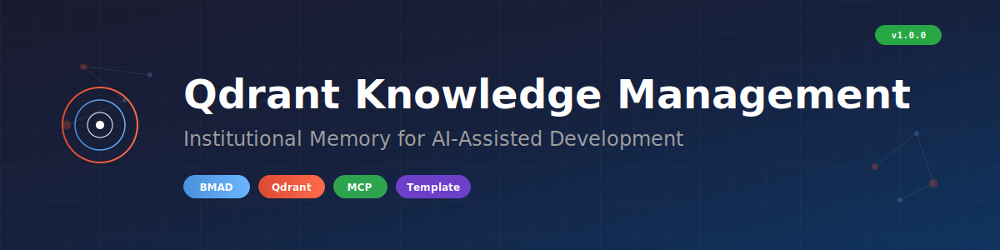

<p align="center">
  
</p>

<h1 align="center">Qdrant MCP Knowledge Management for BMAD</h1>

<p align="center">
  <strong>Institutional memory system for AI-assisted development using Qdrant vector database</strong>
</p>

<p align="center">
  <a href="https://github.com/Hidden-History/bmad-qdrant-knowledge-management/actions/workflows/ci.yml"></a>
  <a href="LICENSE"></a>
  <a href="https://github.com/bmad-code-org/BMAD-METHOD"></a>
  <a href="https://github.com/qdrant/mcp-server-qdrant"></a>
  <a href="https://github.com/Hidden-History/bmad-qdrant-knowledge-management/releases"></a>
</p>

## TL;DR

Prevent AI from repeating mistakes. Store architectural decisions, agent specs, error patterns, and story outcomes in a searchable vector database. Works with BMAD workflows out of the box.

**What this solves:**
- AI forgetting previous decisions across sessions
- Repeating the same mistakes
- Losing architectural knowledge when context resets
- No continuity between development sessions

---

## 🎯 About This Template

**This is a real system I use daily** for my own large-scale development projects. After seeing how much it improved my AI-assisted workflow, I've packaged it as a template so others can benefit too.

### Why I Built This

When working on complex projects with AI assistants (Claude, GPT, etc.), I kept running into the same problems:
- AI would forget architectural decisions from previous sessions
- Same bugs got solved multiple times
- Context window limits meant constantly re-explaining the project

This knowledge management system solved all of that. Now my AI assistants have persistent memory across sessions.

### How to Use This Template

1. **Click "Use this template"** on GitHub to create your own copy
2. **Customize for your project:**
   - Update `.env` with your collection names
   - Modify metadata schemas if needed
   - Add your own knowledge types
3. **Start storing knowledge** - architectural decisions, error patterns, agent specs

### What You Might Change

| Aspect | Default | Your Customization |
|--------|---------|-------------------|
| Collection names | `bmad-knowledge` | `yourproject-knowledge` |
| `group_id` | `demo_project` | `your_project_name` |
| Knowledge types | 8 types | Add/remove as needed |
| Metadata fields | BMAD-focused | Your workflow fields |

### This is NOT a Library

This is a **starter template**, not a package you install. Fork it, modify it, make it yours. The code is intentionally simple so you can understand and adapt it.

---

## Quick Links

| I want to... | Go to |
|--------------|-------|
| Understand this template | [About This Template](#-about-this-template) |
| Get started in 15 minutes | [QUICKSTART.md](QUICKSTART.md) |
| Configure for my project | [CONFIGURATION.md](CONFIGURATION.md) |
| Understand Qdrant & vectors | [Understanding Qdrant](#-understanding-qdrant-your-ais-persistent-memory) |
| Learn about multitenancy | [Multitenancy](#-multitenancy-isolating-projects--users) |
| Understand the architecture | [ARCHITECTURE.md](ARCHITECTURE.md) |
| Troubleshoot an issue | [TROUBLESHOOTING.md](TROUBLESHOOTING.md) |
| Integrate with BMAD | [BMAD_INTEGRATION_RULES.md](BMAD_INTEGRATION_RULES.md) |
| Contribute | [CONTRIBUTING.md](CONTRIBUTING.md) |

## Features

- **Semantic Search** - Find relevant past work using natural language
- **Duplicate Prevention** - Content hashing and similarity checks prevent redundant entries
- **Schema Validation** - JSON Schema validation ensures data quality
- **BMAD Integration** - Works with BMAD workflows (dev-story, sprint-planning)
- **8 Knowledge Types** - Architecture, agents, stories, errors, schemas, configs, examples, best practices
- **Two Collections** - Project-specific knowledge + universal best practices
- **Configurable** - Customize collection names, embedding models, and more

## Installation

### Prerequisites

- Python 3.9+
- Docker & Docker Compose (or Qdrant Cloud)
- Claude Code or Claude Desktop with MCP support

### Quick Start

```bash
# 1. Clone or use as template
git clone https://github.com/Hidden-History/bmad-qdrant-knowledge-management.git
cd bmad-qdrant-knowledge-management

# 2. Install dependencies
pip install -r requirements.txt

# 3. Configure environment
cp .env.example .env
# Edit .env with your settings

# 4. Start Qdrant (one command!)
docker compose up -d

# 5. Create collections
python scripts/create_collections.py

# 6. Configure Claude MCP (see below)
```

> **Tip:** Use `docker compose logs -f` to monitor Qdrant, `docker compose down` to stop.

### Configure Claude MCP

Add to your Claude Code settings or Claude Desktop config:

```json
{
  "mcpServers": {
    "qdrant": {
      "command": "npx",
      "args": ["-y", "@modelcontextprotocol/server-qdrant"],
      "env": {
        "QDRANT_URL": "http://localhost:6333",
        "COLLECTION_NAME": "bmad-knowledge"
      }
    }
  }
}
```

## Usage

### Search Before Implementing

Before starting any significant work, search for related past decisions:

```
Search Qdrant for: "database connection pooling configuration"
```

The MCP server will find semantically similar entries about connection pooling decisions, past implementations, and any errors encountered.

### Store After Completing

When you finish a story, make an architectural decision, or solve a tricky problem:

```python
# Store implementation outcome
mcp__qdrant__qdrant-store(
    information="Implemented connection pooling with max 20 connections...",
    metadata={
        "unique_id": "story-auth-pooling-20250101",
        "type": "story_outcome",
        "component": "database",
        "importance": "high",
        "created_at": "2025-01-01"
    }
)
```

### Daily Workflow

1. **Morning** - Search for context on today's work
2. **During Work** - Search before implementing new features
3. **Story Completion** - Store outcomes (via BMAD workflows or manually)
4. **Problem Solved** - Store error patterns and solutions

## Knowledge Types

| Type | Purpose | Example |
|------|---------|---------|
| `architecture_decision` | Major design choices | "Use PostgreSQL for metadata storage" |
| `agent_spec` | Agent capabilities and integration | "OCR Processor agent handles PDF extraction" |
| `story_outcome` | Completed implementations | "Story 2-17: Auth system complete" |
| `error_pattern` | Problems and solutions | "Docker connection refused - check ports" |
| `database_schema` | Table structures | "users table with UUID primary key" |
| `config_pattern` | Configuration examples | "Qdrant MCP dual-collection setup" |
| `integration_example` | Working code patterns | "Batch upsert with 50-point batches" |
| `best_practice` | Universal patterns | "Always validate before storage" |

## Project Structure

```
bmad-qdrant-knowledge-management/
├── README.md                    # This file
├── QUICKSTART.md               # 15-minute setup guide
├── CONFIGURATION.md            # Configuration options
├── ARCHITECTURE.md             # System design
├── TROUBLESHOOTING.md          # Common issues
├── CONTRIBUTING.md             # Contribution guide
├── BMAD_INTEGRATION_RULES.md   # BMAD agent rules
├── config.py                   # Configuration module
├── .env.example                # Environment template
├── LICENSE                     # MIT License
├── metadata-schemas/           # JSON schemas (8 types)
│   ├── architecture_decision.json
│   ├── agent_spec.json
│   └── ...
├── scripts/                    # Operational scripts
│   ├── create_collections.py
│   ├── qdrant_cleanup.py
│   └── ...
├── validation/                 # Validation tools
│   ├── validate_metadata.py
│   ├── check_duplicates.py
│   └── ...
├── examples/                   # Usage examples
│   └── search_patterns.py
├── example_population/         # Example population scripts
└── tracking/                   # Knowledge inventory
    └── knowledge_inventory.md
```

## BMAD Integration

This system integrates with [BMAD-METHOD](https://github.com/bmad-code-org/BMAD-METHOD) workflows:

- **dev-story** - Can trigger knowledge storage on story completion
- **sprint-planning** - Search for related past work before planning
- **party-mode** - All agents can access shared knowledge
- **code-review** - Check for known error patterns

See [BMAD_INTEGRATION_RULES.md](BMAD_INTEGRATION_RULES.md) for detailed agent enforcement rules.

---

## 🧠 Understanding Qdrant: Your AI's Persistent Memory

### What is Qdrant?

Qdrant is a **vector similarity search engine** that serves as persistent memory for AI assistants. Unlike traditional databases that match exact values, Qdrant understands *semantic meaning* - finding conceptually similar content even when words differ.

```
Traditional DB: "authentication error" → Only finds exact matches
Qdrant:         "authentication error" → Finds "login failed", "auth timeout", "credential issues"
```

### Why Qdrant + BMAD Method?

| Challenge | Without Qdrant | With Qdrant |
|-----------|---------------|-------------|
| **Context Limits** | AI forgets after ~200K tokens | Unlimited searchable memory |
| **Past Decisions** | Re-explain architecture every session | AI finds relevant decisions instantly |
| **Error Patterns** | Solve same bugs repeatedly | AI recalls solutions from knowledge base |
| **Best Practices** | Lost in old chat logs | Searchable, categorized, cross-referenced |

### How It Works

```
1. STORE: Your knowledge → Embedding Model → Vector (384 numbers) → Qdrant
2. SEARCH: Query → Embedding Model → Vector → Find Similar Vectors → Results

Example:
  "How do we handle API errors?"
       ↓ (embedding)
  [0.23, -0.15, 0.89, ...384 dimensions...]
       ↓ (similarity search)
  Returns: error-api-timeout-pattern, arch-decision-error-handling, story-2-5-api-refactor
```

---

### 🔑 Qdrant ID System & Data Organization

#### Point IDs vs Payload Metadata

Qdrant uses two distinct identifier concepts:

| Concept | Purpose | Example |
|---------|---------|---------|
| **Point ID** | Internal vector identifier | UUID or auto-increment integer |
| **Payload Metadata** | Your custom identifiers & filters | `unique_id`, `group_id`, `type` |

```python
# Point structure in Qdrant
{
    "id": "550e8400-e29b-41d4-a716-446655440000",  # Point ID (Qdrant's internal)
    "vector": [0.23, -0.15, 0.89, ...],            # Embedding
    "payload": {                                    # YOUR metadata
        "unique_id": "arch-decision-auth-2024-12-15",  # Human-readable ID
        "group_id": "project_legal_ai",                # Tenant/project isolation
        "type": "architecture_decision",
        "component": "authentication"
    }
}
```

#### Recommended ID Strategy (2025)

Based on [official Qdrant recommendations](https://github.com/qdrant/qdrant/discussions/3461):

| ID Type | Use Case | Example |
|---------|----------|---------|
| **UUID** (Recommended) | General use, zero collision risk | `550e8400-e29b-41d4-...` |
| **Auto-increment** | Sequential data, simple tracking | `1, 2, 3...` |

**This template uses descriptive `unique_id` in payload**: `{type}-{component}-{date}`
- Human-readable for debugging
- Collision-free with date suffix
- Easy to reference in documentation
- Searchable and filterable

---

### 🏢 Multitenancy: Isolating Projects & Users

Qdrant's **multitenancy** allows multiple projects, teams, or users to share a single collection while keeping data completely isolated. This is the **official recommended pattern** for per-project or per-user knowledge bases.

#### How Data Isolation Works

```
┌─────────────────────────────────────────────────────────────┐
│                    Single Qdrant Collection                  │
│  ┌─────────────────┐  ┌─────────────────┐  ┌──────────────┐ │
│  │  Project Alpha  │  │  Project Beta   │  │  Project X   │ │
│  │  group_id: "A"  │  │  group_id: "B"  │  │ group_id:"X" │ │
│  │  ┌───┐ ┌───┐   │  │  ┌───┐ ┌───┐   │  │  ┌───┐      │ │
│  │  │ ● │ │ ● │   │  │  │ ● │ │ ● │   │  │  │ ● │      │ │
│  │  └───┘ └───┘   │  │  └───┘ └───┘   │  │  └───┘      │ │
│  └─────────────────┘  └─────────────────┘  └──────────────┘ │
└─────────────────────────────────────────────────────────────┘

Query with filter: group_id == "A"
→ Only searches Project Alpha's vectors
→ Other projects' data is invisible
```

#### Implementation Pattern

```python
# 1. STORING: Always include group_id in payload
mcp__qdrant__qdrant-store(
    information="Authentication uses JWT with 24h expiry...",
    metadata={
        "unique_id": "arch-decision-auth-2024-12-15",
        "group_id": "project_legal_ai",  # ← Tenant identifier
        "type": "architecture_decision",
        ...
    }
)

# 2. SEARCHING: Filter by group_id for isolation
# The MCP server handles this automatically when configured
# Or manually in direct Qdrant queries:
client.search(
    collection_name="bmad-knowledge",
    query_vector=embedding,
    query_filter=Filter(
        must=[
            FieldCondition(
                key="group_id",
                match=MatchValue(value="project_legal_ai")
            )
        ]
    )
)
```

#### Formal Multitenancy Configuration

For production deployments, Qdrant supports **tiered multitenancy** with the `is_tenant` flag:

```python
# Create collection with tenant field optimization
client.create_collection(
    collection_name="bmad-knowledge",
    vectors_config=VectorParams(size=384, distance=Distance.COSINE),
)

# Create payload index with tenant optimization
client.create_payload_index(
    collection_name="bmad-knowledge",
    field_name="group_id",
    field_schema=PayloadSchemaType.KEYWORD,
    is_tenant=True  # ← Optimizes filtering for this field
)
```

#### Use Cases for Multitenancy

| Scenario | `group_id` Value | Benefit |
|----------|------------------|---------|
| **Multiple Projects** | `"project_legal_ai"`, `"project_healthcare"` | One Qdrant instance, isolated knowledge |
| **Team Separation** | `"team_backend"`, `"team_frontend"` | Shared infra, private knowledge |
| **User-Specific** | `"user_alice"`, `"user_bob"` | Personal AI memory per user |
| **Environment** | `"dev"`, `"staging"`, `"prod"` | Same collection, environment isolation |

#### Why This Pattern?

| Approach | Pros | Cons |
|----------|------|------|
| **Separate Collections** | Complete isolation | Operational overhead, resource duplication |
| **Separate Databases** | Maximum isolation | High cost, complex management |
| **Payload Filtering** ✅ | Efficient, scalable, cost-effective | Requires consistent filter discipline |

> 📌 **Best Practice**: Always include `group_id` in metadata, even for single-project use. This future-proofs your knowledge base for multi-project expansion.

---

### ⚡ Performance Optimization

#### Embedding Model Selection

| Model | Dimensions | Speed | Quality | Use Case |
|-------|------------|-------|---------|----------|
| `all-MiniLM-L6-v2` | 384 | ⚡⚡⚡ Fast | Good | **Default - Best for most projects** |
| `all-mpnet-base-v2` | 768 | ⚡⚡ Medium | Better | Large knowledge bases |
| `text-embedding-3-small` | 1536 | ⚡ Slower | Best | Production with budget |

#### Memory Optimization (Quantization)

```python
# Scalar Quantization - 75% memory reduction
# float32 → uint8 with minimal quality loss
vectors_config=VectorParams(
    size=384,
    distance=Distance.COSINE,
    quantization_config=ScalarQuantization(
        type=ScalarType.INT8,
        quantile=0.99,
        always_ram=True
    )
)
```

| Technique | Memory Reduction | Speed Impact | Quality Loss |
|-----------|-----------------|--------------|--------------|
| **None** | Baseline | Baseline | None |
| **Scalar** | 75% smaller | Same speed | <1% |
| **Binary** | 97% smaller | 40x faster | 5-10% |

#### HNSW Index Tuning

```python
# For large knowledge bases (1000+ entries)
hnsw_config=HnswConfigDiff(
    m=16,              # Connections per node (default: 16)
    ef_construct=100,  # Build-time search depth (default: 100)
)

# Search-time parameter
search_params=SearchParams(
    hnsw_ef=128,       # Higher = better quality, slower
)
```

| Parameter | Lower Value | Higher Value |
|-----------|-------------|--------------|
| `m` | Faster builds, less accurate | Better recall, more memory |
| `ef_construct` | Faster indexing | Better index quality |
| `ef` (search) | Faster search | More accurate results |

#### Payload Index for Filtering

When using multitenancy or frequent filtering, create payload indexes:

```python
# Index tenant field for fast filtering
client.create_payload_index(
    collection_name="bmad-knowledge",
    field_name="group_id",
    field_schema=PayloadSchemaType.KEYWORD,
    is_tenant=True
)

# Index type field for category filtering
client.create_payload_index(
    collection_name="bmad-knowledge",
    field_name="type",
    field_schema=PayloadSchemaType.KEYWORD
)
```

---

### 💾 Storage Modes

| Mode | Best For | Configuration |
|------|----------|---------------|
| **In-Memory** | <10K vectors, fastest queries | Default |
| **Memmap** | 10K-1M vectors, balanced | `on_disk=False, memmap_threshold=10000` |
| **On-Disk** | >1M vectors, memory-constrained | `on_disk=True` |

---

### 📊 Batch Operations

For optimal performance when populating knowledge bases:

```python
# Optimal batch size: 100-500 vectors
BATCH_SIZE = 250  # Sweet spot for most systems

# 68% faster than single inserts
# 2.5s → 0.8s per 1000 vectors
```

---

### 🔗 Official Qdrant Resources

| Resource | Link |
|----------|------|
| Qdrant Documentation | [qdrant.tech/documentation](https://qdrant.tech/documentation/) |
| MCP Server Setup | [GitHub: qdrant/mcp-server-qdrant](https://github.com/qdrant/mcp-server-qdrant) |
| Optimization Guide | [Vector Search Resource Optimization](https://qdrant.tech/documentation/guides/optimize/) |
| Multitenancy Guide | [Qdrant Multitenancy](https://qdrant.tech/documentation/guides/multiple-partitions/) |
| Cloud Console | [cloud.qdrant.io](https://cloud.qdrant.io/) |

---

### 🎯 Quick Reference: MCP Tools

```bash
# Store knowledge (with tenant isolation)
mcp__qdrant__qdrant-store(
    information="Your knowledge content here",
    metadata={
        "unique_id": "arch-decision-example-2024-12-15",
        "group_id": "your_project_id",  # ← Always include for isolation
        "type": "architecture_decision",
        ...
    }
)

# Search knowledge
mcp__qdrant__qdrant-find(
    query="authentication error handling patterns"
)
```

**Search Tips:**
- Use 2-5 focused keywords
- Include specific technical terms
- Combine domain + technical concepts
- See [examples/search_patterns.py](examples/search_patterns.py) for patterns

---

## Configuration

All configuration is centralized in `config.py` and loaded from environment variables.

Key settings (in `.env`):
```bash
QDRANT_URL=http://localhost:6333
QDRANT_KNOWLEDGE_COLLECTION=bmad-knowledge
QDRANT_BEST_PRACTICES_COLLECTION=bmad-best-practices
```

See [CONFIGURATION.md](CONFIGURATION.md) for all options.

## What to Store

### ALWAYS Store
- **Architecture decisions** - Major design choices, especially breaking changes
- **Agent specifications** - Capabilities, dependencies, integration points
- **Critical database schemas** - Tables, constraints, migrations
- **Error patterns** - Problems and solutions (severity: high/critical)
- **Story outcomes** - Implementation details after completion

### NEVER Store
- Credentials, secrets, API keys
- Operational/transactional data
- Raw documents, PDFs, binary files
- Frequently changing config values
- Trivial implementation details

## Success Metrics

You'll know it's working when:
- AI finds past solutions before reinventing
- Reduced repeated mistakes
- Faster session resumption
- Better architectural consistency
- Self-documenting system

## Contributing

Contributions are welcome! Please read [CONTRIBUTING.md](CONTRIBUTING.md) for guidelines.

## License

MIT License - See [LICENSE](LICENSE)

## Credits

Built for use with [BMAD-METHOD](https://github.com/bmad-code-org/BMAD-METHOD).

Powered by [Qdrant](https://qdrant.tech/) vector database and [MCP](https://modelcontextprotocol.io/) protocol.
